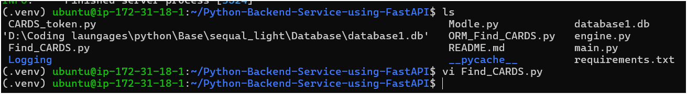
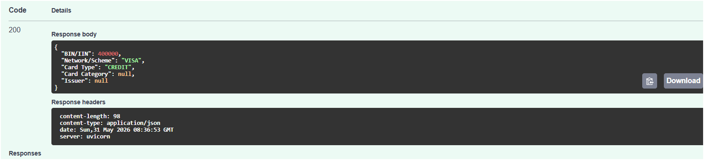
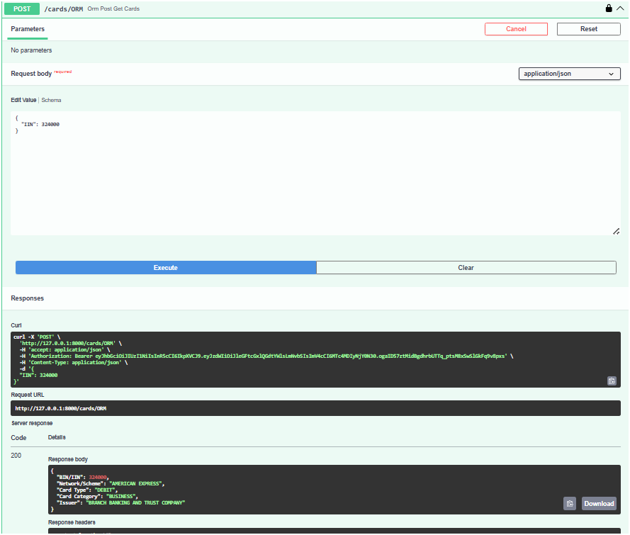
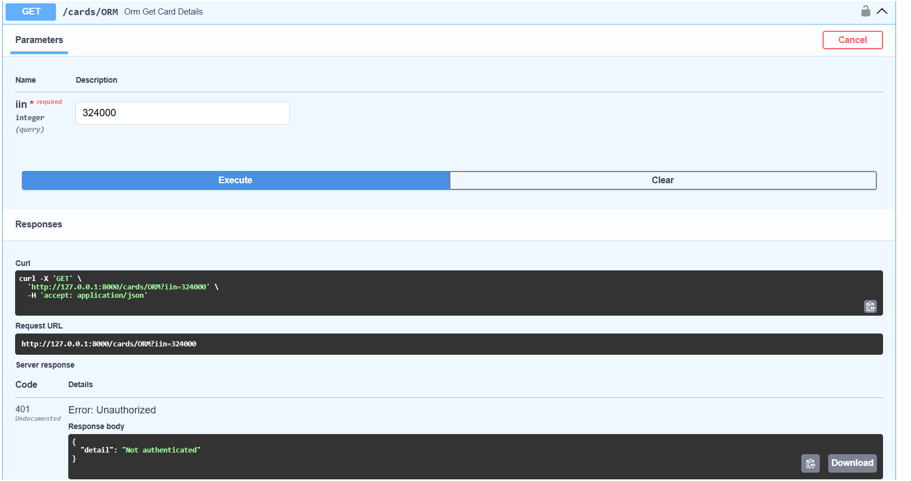

# Python Backend Service using FastAPI

A FastAPI-based backend service for looking up card BIN/IIN information from a SQLite database, with both Raw SQL and SQLAlchemy ORM implementations. The project also includes JWT-based authentication for protected endpoints and has been deployed on AWS EC2 using Uvicorn and Nginx.

---

# 🚀 Features

- FastAPI application with modular route files
- SQLite database integration
- Two data access approaches:
  - Raw SQL (`sqlite3`)
  - SQLAlchemy ORM
- JWT Authentication for protected endpoints
- Structured logging support
- Interactive Swagger UI
- Production deployment on AWS EC2
- Uvicorn ASGI Server
- Nginx Reverse Proxy

---

# ☁️ Deployment

This backend was successfully deployed on an **AWS EC2 Ubuntu instance** using **Uvicorn** as the ASGI server and **Nginx** as a reverse proxy.

### Deployment Architecture

```text
                Internet
                    │
                    ▼
         Nginx (Reverse Proxy)
                    │
                    ▼
          Uvicorn (ASGI Server)
                    │
                    ▼
              FastAPI Backend
                    │
                    ▼
             SQLite Database
```

### Deployment Highlights

- Hosted on AWS EC2
- FastAPI served using Uvicorn
- Nginx configured as Reverse Proxy
- JWT Authentication
- Interactive Swagger Documentation
- Modular Backend Architecture

---

# 🛠️ Tech Stack

- Python
- FastAPI
- SQLite
- SQLAlchemy
- python-jose (JWT)
- Uvicorn
- Nginx
- AWS EC2

---

# 📁 Project Structure

```bash
.
├── main.py                 # App entrypoint
├── Find_CARDS.py           # Raw SQL endpoints
├── ORM_Find_CARDS.py       # ORM endpoints
├── CARDS_token.py          # JWT generation & verification
├── Modle.py                # SQLAlchemy & Pydantic models
├── engine.py               # Database engine configuration
├── Logging/
│   └── zlogger_config.py
├── images/
│   ├── ec2-terminal.png
│   ├── orm-post.png
│   ├── swagger-response.png
│   └── unauthorized.png
├── requirements.txt
└── README.md
```

---

# 📸 Project Preview

## AWS EC2 Deployment

SSH session inside the Ubuntu EC2 instance hosting the FastAPI backend.



---

## Successful API Response

Example response returned by the BIN/IIN lookup endpoint.



---

## JWT Protected ORM Endpoint

Successful request to a protected ORM endpoint after providing a valid JWT token.



---

## Authentication Validation

Accessing a protected endpoint without authentication returns a **401 Unauthorized** response.



---

# 🌐 API Overview

## Public Endpoints

### `GET /cards/raw?IIN=123456`

Fetch card details using Raw SQL.

---

### `POST /cards`

Fetch card details using request body.

---

### `POST /allCards?name=visa`

Retrieve BIN list by card scheme.

---

## 🔐 Authentication Endpoint

### `POST /getToken?Mail=user@example.com`

Generate a JWT access token.

---

## 🔒 Protected Endpoints

> Requires Bearer Token Authentication

### `GET /cards`

Retrieve card details using SQLAlchemy ORM.

---

### `POST /cards`

Retrieve card details using request body.

---

### `POST /allCards`

Retrieve BIN list using ORM.

---

## ⚠️ Note

Some routes share the same endpoint names between the Raw SQL and ORM implementations.

If both routers are enabled simultaneously, the active route depends on the router registration order inside `main.py`.

---

# ⚙️ Getting Started

## 1. Clone the Repository

```bash
git clone https://github.com/Yogendra2804/Python-Backend-Service-using-FastAPI.git

cd Python-Backend-Service-using-FastAPI
```

---

## 2. Create a Virtual Environment

```bash
python -m venv .venv
```

### Windows

```powershell
.venv\Scripts\Activate.ps1
```

### Linux / macOS

```bash
source .venv/bin/activate
```

---

## 3. Install Dependencies

```bash
pip install -r requirements.txt
```

---

## 4. Run the Server

```bash
uvicorn main:app --reload
```

The application will be available at

```
http://127.0.0.1:8000
```

Swagger Documentation

```
http://127.0.0.1:8000/docs
```

---

# 🔑 Authentication

1. Generate a JWT token using

```
POST /getToken
```

2. Copy the returned token.

3. Open Swagger UI.

4. Click **Authorize**.

5. Enter

```
Bearer <your_token>
```

6. Access the protected endpoints.

---

# 📦 Example Request Body

```json
{
    "IIN": 123456
}
```

---

# 📚 Current Learning Focus

This project is intentionally built as a learning-focused backend project.

Current learning areas include:

- FastAPI
- REST API Design
- SQLAlchemy ORM
- Raw SQL vs ORM
- JWT Authentication
- Logging
- AWS EC2 Deployment
- Uvicorn
- Nginx Reverse Proxy
- Backend Architecture

---

# 🛣️ Roadmap

- [x] FastAPI REST API
- [x] SQLite Integration
- [x] Raw SQL Implementation
- [x] SQLAlchemy ORM
- [x] JWT Authentication
- [x] Logging
- [x] AWS EC2 Deployment
- [x] Uvicorn Configuration
- [x] Nginx Reverse Proxy
- [ ] Move secrets to environment variables
- [ ] Improve HTTP error handling
- [ ] Resolve overlapping routes
- [ ] Unit testing with pytest
- [ ] Docker support
- [ ] CI/CD using GitHub Actions
- [ ] PostgreSQL Migration
- [ ] HTTPS using Let's Encrypt

---

# 🤝 Contributing

Contributions, suggestions, and improvements are always welcome.

Feel free to fork the repository, open an issue, or submit a pull request.

---

# 👨‍💻 Author

**Yogendra Gupta**

GitHub: https://github.com/Yogendra2804

---

⭐ If you found this project useful, consider giving it a star!
